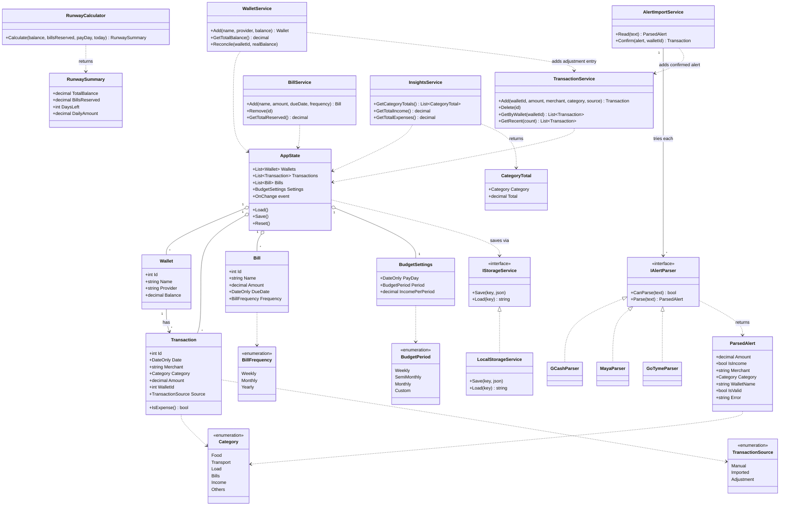
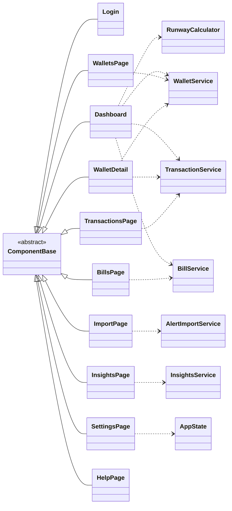

# One Wallet: Class Diagram

Design blueprint for the Blazor version of One Wallet. It mirrors the logic already working in the HTML prototype (`index.html`). GitHub renders the diagrams below automatically.

## 1. Domain models and services



## 2. Blazor pages and the services they use



## 3. Suggested project structure

```
OneWallet/
├── Models/        Wallet, Transaction, Bill, BudgetSettings, ParsedAlert, RunwaySummary, CategoryTotal, enums
├── Services/      AppState, WalletService, TransactionService, BillService,
│                  RunwayCalculator, InsightsService, AlertImportService, LocalStorageService
├── Parsers/       IAlertParser, GCashParser, MayaParser, GoTymeParser
├── Pages/         Login, Dashboard, WalletsPage, WalletDetail, TransactionsPage,
│                  ImportPage, BillsPage, InsightsPage, SettingsPage, HelpPage
└── Program.cs     registers every service for dependency injection
```

## 4. Where each class comes from in the prototype

| Class | Prototype code it replaces |
|---|---|
| `RunwayCalculator` | `per()`, `days()`, `res()`: (balance minus bills) divided by days until payday |
| `AlertImportService` + parsers | `rd()` and `okp()` |
| `WalletService.Reconcile` | `doRec()`: adds an Adjustment transaction for the difference |
| `TransactionService` | `add()` and `del()`: each one updates the wallet balance |
| `InsightsService` | the `ins` view: sums expenses by category |
| `AppState` + `LocalStorageService` | the `S` object and the localStorage save and load |

## 5. Build order
1. Models and enums
2. `AppState` and the services (no UI yet)
3. `RunwayCalculator` and the parsers, with unit tests
4. Pages, one at a time, starting with Dashboard
5. Register everything in `Program.cs`
